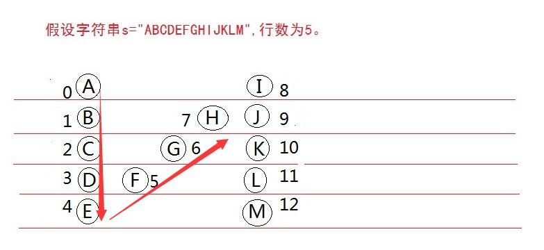

# LeetCode

至少每天一道难度中上算法题，come on.

- 2019-06-20: [3. Longest Substring Without Repeating Characters](https://leetcode.com/problems/longest-substring-without-repeating-characters/) 【优化】
- 2019-06-21: [5. Longest Palindromic Substring](https://leetcode.com/problems/longest-palindromic-substring/submissions/) 【优化】
- 补：2019-06-22 [6. ZigZag Conversion](https://leetcode.com/problems/zigzag-conversion/)
- 补：2019-06-23 [11. Container With Most Water](https://leetcode.com/problems/container-with-most-water/)
- 2019-06-24 [17. Letter Combinations of a Phone Number](https://leetcode.com/problems/letter-combinations-of-a-phone-number/) 【优化】
- 2019-06-25 [15. 3Sum](https://leetcode.com/problems/3sum/)
- 2019-06-26 [16. 3Sum Closest](https://leetcode.com/problems/3sum-closest/)
- 2019-06-27 [18. 4Sum](https://leetcode.com/problems/4sum/) beats 75.80 % 
- 2019-06-28
  - [19. Remove Nth Node From End of List](https://leetcode.com/problems/remove-nth-node-from-end-of-list/submissions/)
  - e
- 2019-06-29 [8. String to Integer (atoi)](https://leetcode.com/problems/string-to-integer-atoi/) (再看下优化解法)
- 2019-06-30 [12. Integer to Roman](https://leetcode.com/problems/integer-to-roman/)

## 解释

> 1. http://algorithm.books.mafengshe.com/answer/6.html

待补充 3，5

### 6. ZigZag Conversion
> http://algorithm.books.mafengshe.com/answer/6.html  

  

  ```bash
  i 行遍历
  j V 组遍历
  ****************
  1. 当 i=0;
    第一行两个数据分别为 s[0], s[8];
  2. 当 i=1;
    j=1;
    第一个数：push s[1];
    第二个斜方向数：(j-1)+(size-1)
      位置:（size-1）7
      分组的起始下标：(j-1) 0
    第三个数：push s[9]
  3. 当 i;
    j=i;
    第一行和最后一行直接 push s[j]；
    第二个数：(j-i)+(size-i)
      位置:（size-i）
      分组的起始下标：(j-i)

    j+size 循环
  ```
### 11. Container With Most Water
> tip: 
 一般思路：双层循环搞定  
 O(1)思路：两个指示器，两边比较进行 .
   
https://leetcode.com/problems/container-with-most-water/solution/

